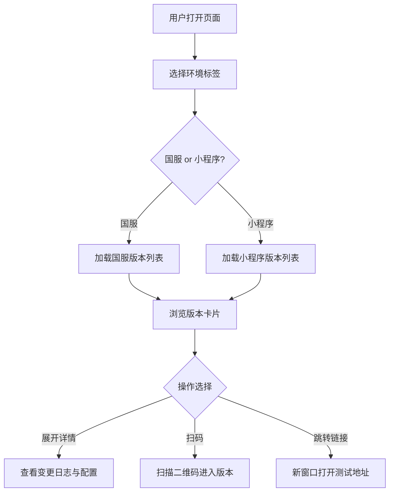

## 1. 产品概述

多版本测试管理平台 —— 用于管理、对比和切换"国服"、"小程序"等多环境多版本产品的静态测试页面。面向开发与测试团队，提供清晰的版本状态总览与快速入口。

- 解决多版本、多环境测试入口分散、状态不直观的问题
- 提升团队在版本迭代中的测试效率与信息同步能力

## 2. 核心功能

### 2.1 功能模块

1. **版本总览页**：环境切换标签（国服/小程序）、版本卡片列表、状态标识、快速跳转入口
2. **版本详情区**：版本号、构建时间、环境配置、二维码/链接入口、变更日志摘要

### 2.2 页面详情

| 页面名称 | 模块名称 | 功能描述 |
|----------|----------|----------|
| 版本总览页 | 环境切换标签 | 顶部标签栏切换"国服"、"小程序"等环境，高亮当前选中 |
| 版本总览页 | 版本卡片列表 | 每个版本以卡片展示：版本号、状态（开发中/测试中/已发布）、构建时间、操作按钮 |
| 版本总览页 | 搜索与筛选 | 按版本号搜索、按状态筛选 |
| 版本总览页 | 快速入口 | 每张卡片提供二维码区域和跳转链接按钮 |
| 版本总览页 | 变更日志 | 卡片展开后显示该版本简要变更内容 |

## 3. 核心流程

用户打开页面 → 选择环境标签（国服/小程序）→ 浏览该环境下所有版本卡片 → 点击卡片展开详情/扫码/跳转链接

## 4. 用户界面设计

### 4.1 设计风格

- 主色调：深色科技感（#0F172A 深蓝黑底 + #3B82F6 亮蓝强调 + #10B981 绿色状态）
- 按钮风格：圆角微凸起，hover 发光效果
- 字体：思源黑体 / Noto Sans SC，标题加粗 700，正文 400
- 布局：顶部导航 + 标签切换 + 网格卡片流
- 图标：线性图标风格（Lucide Icons）

### 4.2 页面设计概览

| 页面名称 | 模块名称 | UI 元素 |
|----------|----------|---------|
| 版本总览页 | 环境切换标签 | 顶部固定标签栏，选中态底部蓝色下划线 + 背景微亮，未选中灰色 |
| 版本总览页 | 版本卡片 | 圆角卡片，深色玻璃拟态背景，左上角状态圆点（绿/黄/红），右上角版本号，底部操作按钮行 |
| 版本总览页 | 搜索筛选栏 | 搜索输入框 + 状态下拉筛选，半透明背景 |
| 版本总览页 | 二维码区域 | 卡片展开后中央显示二维码占位图，下方复制链接按钮 |

### 4.3 响应式

- 桌面优先设计，3列卡片网格
- 平板适配2列，移动端单列
- 触控优化：卡片点击区域 ≥ 44px

### 4.4 动效

- 页面加载：卡片依次淡入上移（stagger 100ms）
- 标签切换：内容区平滑过渡
- 卡片 hover：微上浮 + 边框发光
- 卡片展开：高度动画 + 详情区淡入
