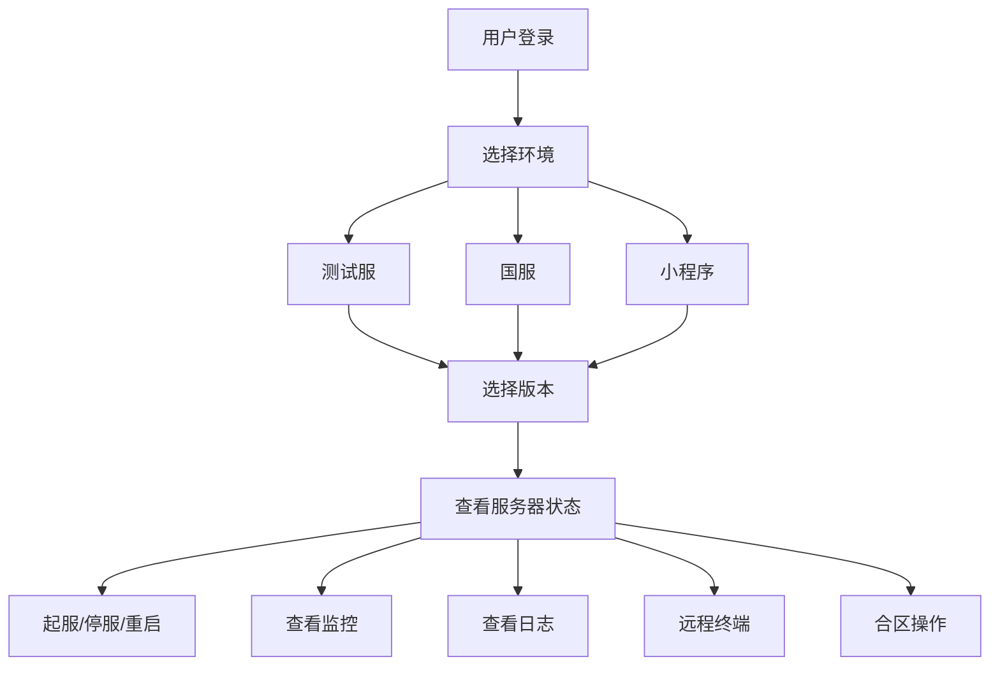

## 1. 产品概述

GameOps 运维平台前端 — 游戏服务器统一管理面板，支持测试服、国服、小程序多版本环境的服务器状态查看与运维操作入口。
- 为游戏运维团队提供一站式的服务器管理、监控、日志、终端操作界面
- 支持多环境（测试服/国服/小程序）多版本并行管理与快速切换

## 2. 核心功能

### 2.1 用户角色
| 角色 | 注册方式 | 核心权限 |
|------|----------|----------|
| 超级管理员 | 后台分配 | 全部权限，项目与用户管理 |
| 运维工程师 | 管理员邀请 | 服务器操作、监控查看、日志查看、终端访问 |
| 运维实习生 | 管理员邀请 | 只读查看，需审批后执行操作 |

### 2.2 功能模块
1. **总览面板 (Dashboard)**: 环境切换、服务器状态总览、告警摘要、快捷操作
2. **服务器管理**: 服务器列表、起服/停服/重启、批量操作
3. **合区中心**: 合区任务列表、合区流程、冲突预检
4. **监控中心**: 指标图表、告警规则、告警历史
5. **日志中心**: 实时日志流、日志检索、日志下载
6. **远程终端**: Web终端、会话管理、操作审计

### 2.3 页面详情
| 页面名称 | 模块名称 | 功能描述 |
|----------|----------|----------|
| 总览面板 | 环境切换器 | 顶部环境标签切换：测试服/国服/小程序，切换后全局数据刷新 |
| 总览面板 | 版本选择器 | 每个环境下拉选择版本号（如 v1.2.3、v1.3.0-beta） |
| 总览面板 | 服务器状态卡片 | 按环境分组显示服务器总数、运行中、维护中、已停止数量 |
| 总览面板 | 告警摘要 | 最近24h未恢复告警数量与级别分布 |
| 总览面板 | 快捷操作 | 一键起服、一键停服、快速进入终端 |
| 服务器管理 | 服务器列表 | 表格展示所有服务器，支持按环境/版本/状态筛选 |
| 服务器管理 | 操作面板 | 起服/停服/重启按钮，带确认弹窗 |
| 监控中心 | 指标图表 | 系统指标+应用指标+业务指标图表，支持时间范围选择 |
| 日志中心 | 实时日志 | WebSocket实时推送日志流，支持关键词过滤 |
| 远程终端 | Web终端 | xterm.js终端模拟器，连接到目标服务器 |

## 3. 核心流程

用户打开平台 → 选择环境（测试服/国服/小程序）→ 选择版本 → 查看该环境下的服务器状态 → 执行运维操作（起停/监控/日志/终端）

## 4. 用户界面设计

### 4.1 设计风格
- 主色调：深色系（#0f172a 深蓝黑底色），科技感运维风格
- 强调色：#22d3ee 青色（运行状态）、#f97316 橙色（告警）、#ef4444 红色（异常）、#22c55e 绿色（正常）
- 按钮风格：圆角微凸，带微妙阴影，hover 时发光效果
- 字体：JetBrains Mono（数据/代码）+ Noto Sans SC（中文正文）
- 布局：左侧固定导航栏 + 顶部环境切换栏 + 主内容区
- 图标：Lucide Icons 线性风格

### 4.2 页面设计概览
| 页面名称 | 模块名称 | UI元素 |
|----------|----------|--------|
| 总览面板 | 环境切换器 | 顶部标签栏，测试服/国服/小程序三个标签，选中态带底部高亮条和发光效果 |
| 总览面板 | 版本选择器 | 下拉选择框，显示版本号+发布时间，带版本状态标签（稳定/测试/灰度） |
| 总览面板 | 服务器状态卡片 | 4列卡片网格，每张卡片带图标+数字+趋势小箭头，卡片边框颜色对应状态 |
| 总览面板 | 告警摘要 | 右侧面板，按级别（P0/P1/P2/P3）分组，每条带闪烁动画 |
| 服务器管理 | 服务器列表 | 深色表格，行hover高亮，状态列带彩色圆点，操作列带图标按钮 |
| 监控中心 | 指标图表 | 深色背景折线图/面积图，网格线半透明，数据线带渐变填充 |
| 日志中心 | 实时日志 | 仿终端深色背景，等宽字体，ERROR行红色高亮，自动滚动到底部 |
| 远程终端 | Web终端 | 全屏终端界面，顶部显示连接信息，绿色光标闪烁 |

### 4.3 响应式设计
- 桌面优先设计，最小宽度1280px
- 侧边栏可折叠
- 卡片网格在小屏下从4列变2列

### 4.4 3D场景
- 不适用
