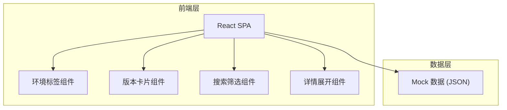

## 1. 架构设计



纯前端静态页面，无后端服务，使用本地 Mock JSON 数据模拟多版本信息。

## 2. 技术说明

- 前端：React@18 + Tailwind CSS@3 + Vite
- 初始化工具：Vite
- 后端：无
- 数据库：无，使用 Mock JSON 数据

## 3. 路由定义

| 路由 | 用途 |
|------|------|
| / | 版本总览页，含环境切换与版本卡片列表 |

## 4. 数据模型

### 4.1 Mock 数据结构

```typescript
interface Version {
  id: string;
  version: string;          // 如 "v2.4.1"
  env: "guofu" | "miniapp"; // 国服 / 小程序
  status: "dev" | "testing" | "released";
  buildTime: string;        // ISO 时间
  url: string;              // 测试链接
  qrcode: string;           // 二维码图片 URL（占位）
  changelog: string[];      // 变更日志条目
}

interface EnvTab {
  key: string;
  label: string;            // 显示名称
  icon: string;             // 图标名
}
```

### 4.2 Mock 数据示例

```json
{
  "envs": [
    { "key": "guofu", "label": "国服", "icon": "server" },
    { "key": "miniapp", "label": "小程序", "icon": "smartphone" }
  ],
  "versions": [
    {
      "id": "g-2.4.1",
      "version": "v2.4.1",
      "env": "guofu",
      "status": "testing",
      "buildTime": "2026-06-09T14:30:00Z",
      "url": "https://test.example.com/guofu/v2.4.1",
      "qrcode": "/placeholder-qr.svg",
      "changelog": ["修复登录超时问题", "优化首页加载速度", "新增消息推送功能"]
    }
  ]
}
```
