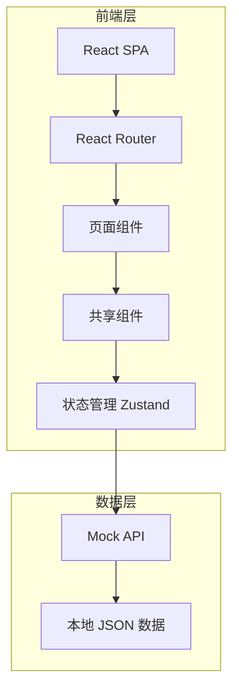

## 1. 架构设计



## 2. 技术说明
- 前端：React@18 + TailwindCSS@3 + Vite
- 初始化工具：Vite
- 后端：无（纯静态页面，使用 Mock 数据）
- 数据库：无（本地 Mock JSON）

## 3. 路由定义
| 路由 | 用途 |
|------|------|
| / | 总览面板，环境切换与服务器状态概览 |
| /servers | 服务器管理列表 |
| /merge | 合区中心 |
| /monitor | 监控中心 |
| /logs | 日志中心 |
| /terminal | 远程终端 |

## 4. API 定义
无后端，使用 Mock 数据。数据结构定义：

```typescript
// 环境
interface Environment {
  id: string;
  name: string;       // 测试服 | 国服 | 小程序
  type: 'test' | 'prod' | 'miniapp';
  versions: Version[];
}

// 版本
interface Version {
  id: string;
  version: string;    // v1.2.3
  releaseDate: string;
  status: 'stable' | 'beta' | 'gray';
}

// 服务器
interface Server {
  id: string;
  name: string;
  ip: string;
  environment: string;
  version: string;
  zoneId: string;
  status: 'running' | 'stopped' | 'maintaining' | 'merging';
  cpu: number;
  memory: number;
  onlinePlayers: number;
  updatedAt: string;
}

// 告警
interface Alert {
  id: string;
  level: 'P0' | 'P1' | 'P2' | 'P3';
  title: string;
  server: string;
  environment: string;
  createdAt: string;
  resolved: boolean;
}
```

## 5. 服务端架构
不适用（纯前端静态页面）

## 6. 数据模型
不适用（无数据库，使用 Mock 数据）
